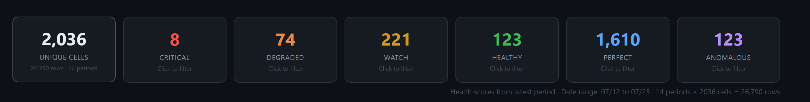
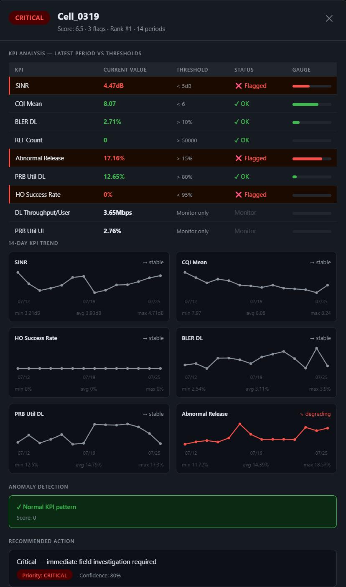
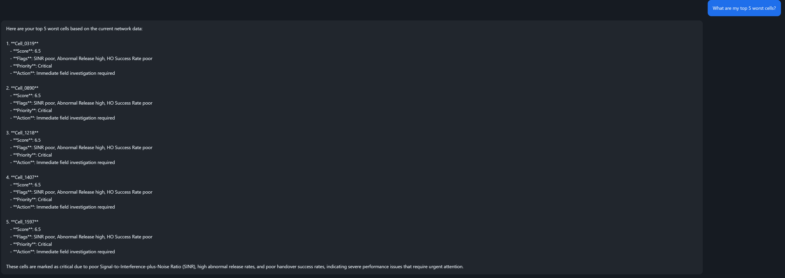

# Telecom AI Portfolio

I spent 20 years optimizing 5G and 4G networks for T-Mobile, Verizon,
AT&T, Bell Canada, Nokia, and Mavenir. This is what happens when you
combine that with machine learning and generative AI.

Six projects. Real data. Deployed tools. Built to solve problems I
actually dealt with in the field.

---

## Screenshots


*2,038 unique cells ranked by health score — upload any Nokia/Ericsson/Samsung OSS export*


*Click any cell — KPI vs threshold table + 14-day sparkline trend charts*


*GPT-4o powered assistant — ask questions about your network in plain English*

---

## Run it yourself

**Requirements:** Python 3.10+, OpenAI API key

```bash
# 1. Clone
git clone https://github.com/Tadparthi/Telecom_AI_Portfolio
cd Telecom_AI_Portfolio

# 2. Create virtual environment
python -m venv venv
venv\Scripts\activate        # Windows
# source venv/bin/activate   # Mac/Linux

# 3. Install dependencies
pip install -r requirements.txt

# 4. Add your OpenAI key
# Create a file called .env in the project folder:
# OPENAI_API_KEY=sk-your-key-here

# 5. Build the RAG knowledge base (first time only)
python build_rag.py

# 6. Start the tool
# Windows: double-click Launch_NOC_Tool.bat
# Mac/Linux:
uvicorn network_health_api:app --host 0.0.0.0 --port 8000

# 7. Open dashboard
# Go to http://localhost:8000/dashboard
```

---

## What the platform does

Five AI-powered panels accessible from the dashboard header:

---

### KPI Upload Analyzer

Drop any Nokia, Ericsson, or Samsung OSS export — CSV or Excel.
Auto-detects column names across all three vendors. No reformatting needed.

Multi-period files get grouped by unique cell automatically. A 14-day
Nokia export with 26,790 rows becomes a ranked list of 2,038 cells,
scored on the most recent period with 14-day trend charts.

Click any cell — KPI vs threshold table with gauge bars and 14-day
sparkline for each KPI showing stable / improving / degrading direction.

The trend detection is what makes this useful. A cell with abnormal
release at 18% is worth monitoring. A cell where it went from 11% to
18% over two weeks is urgent — caught 5 days earlier with trend
monitoring than with threshold alarms.

---

### Auto-Investigate — Autonomous Agent

Click one button. The agent investigates your entire network without
any follow-up questions.

```
Goal: "Investigate my network and identify the top issues"

Step 1  get_network_summary()   → 2,036 cells, 8 critical, 74 degraded
Step 2  get_worst_cells(8)      → all 8 critical cells identified
Step 3  get_cell_detail() x 8  → full KPI + trend per critical cell
Step 4  search_parameters()    → real parameter values from baseline

Output: structured report — executive summary, per-cell findings,
        pattern analysis, root cause assessment, prioritized actions

10 autonomous tool calls. Zero human intervention.
```

The agent identified that all 8 critical cells showed 0% HO success
consistently — not declining, always zero. That pattern means
configuration not hardware. Reached autonomously from the data.

---

### AI Assistant

Conversational GPT-4o with full network context. Answers questions
about your uploaded KPI data in plain English. Cell-specific 14-day
trend fetched on demand when you mention a cell ID. OpenAI calls
proxied through backend — API key never in browser code.

---

### Knowledge Base — RAG Parameter Search

1,695 5G NR parameters indexed in ChromaDB using OpenAI embeddings.
Hybrid semantic + keyword search with event type discrimination
(A3 ranks above A2), MO class preference (NR Cell above NR HO Interface),
and RSRP/RSRQ ranking.

Click Ask AI — GPT-4o explains the parameter using your actual baseline
as the source. No hallucination. Grounded answers only.

The agent uses this as a live tool during investigation — looks up real
operator baseline values before making parameter recommendations.

---

### Beam Analyzer — 5G Massive MIMO Health

Three-tier detection for Massive MIMO beamforming issues:

```
Tier 1 — Isolation Forest
  Trained on healthy cell baseline
  Clears normal cells — no wasted compute

Tier 2 — Random Forest (4-class)
  su_mimo_fallback    UE angular clustering
  beam_misalignment   SSB sweep misconfiguration
  beam_failure        hardware or environment event
  healthy             no issues detected

Tier 3 — Confidence gate
  High confidence  known scenario + recommendations
  Low confidence   unknown_anomaly + manual review flag
```

The key insight: SU-MIMO fallback is invisible to threshold monitoring.
SINR 17dB, CQI 11.4, BLER 3% — no alarm fires. But rank 1.2 with 18
active users means the scheduler cannot find UE pairs with sufficient
angular separation. Cell running at 40% beamforming efficiency with
zero alarms. The cqi_rank_gap derived feature catches it.

---

## The ML projects

### Project 1 — 5G Network Cell Health Monitor
`kpi_anomaly.ipynb` · Real 5G NR OSS data · 26,810 cell-days · 1,915 cells · 14 days

| Layer | Technique | Result |
|-------|-----------|--------|
| Rule-based | Weighted KPI health score | 5 health bands |
| ML | Isolation Forest — 18 features | 1,341 anomalous cell-days |
| Statistical | Linear regression + p-value | 140 degrading cells |

Cell 1123 flagged 5 days before connector failure confirmed.
378 cells caught by ML that passed every individual threshold check.

---

### Project 2 — Handover Failure Root Cause Classifier
`project2_ho_classifier.ipynb` · 700 daily HO failure events

| Model | Classes | Accuracy | CV Score |
|-------|---------|----------|----------|
| A3 event | 5 | 99.7% | 0.998 ± 0.001 |
| A5 event | 4 | 99.3% | 0.995 ± 0.001 |

Two physically separate Random Forest classifiers with real network
parameter values embedded in training data. Recommendation engine maps
each failure class to specific NOC action.

---

### Project 3 — LTE Coverage Predictor + Interactive Map
`project3_coverage_predictor.ipynb` · 567,195 measurements · Vienna

Random Forest regression predicting RSRP at unmeasured locations.
Data leakage identified and corrected (pathloss_db tautology).
Corrected model: RMSE 4.50 dBm, R²=0.8239.
Angle off boresight ranked #1 feature (0.213 importance).
Output: interactive OpenStreetMap heatmap with 4 toggleable layers.

---

### Project 4 — 5G Massive MIMO Beam Health Analyzer
`project4_mimo_analyzer.ipynb` · 500 cells · 30 days · 22 KPIs · 15,000 rows

| Scenario | Key diagnostic signature |
|----------|--------------------------|
| SU-MIMO fallback | cqi_rank_gap > 7.0 (high CQI + low rank) |
| Beam misalignment | beam_switch_count > 15/day |
| Beam failure | BFR spike at failure onset day |
| Unknown anomaly | RF confidence < 60% — new failure mode |

100% accuracy on synthetic data. beam_efficiency composite feature
ranked #1 in importance — captures rank utilization, link quality,
and MU-MIMO pairing in one number.

---

## Why domain knowledge matters

The RLF counter accumulates randomly — raw values are meaningless.
RSRQ not SINR drives handover decisions in A2/A5 scenarios.
SU-MIMO fallback shows identical SINR and CQI to a healthy cell —
only the CQI/rank gap reveals the problem.
Angle off boresight is masked by cell selection in aggregate statistics
but ranked #1 by the Random Forest.

These aren't things you learn from a Kaggle dataset.

---

## Architecture

```
Browser UI (kpi_upload_dashboard.html)
    |
    |-- POST /predict/upload    ML health scoring + trend analysis
    |-- GET  /cell/{id}         on-demand cell detail
    |-- POST /chat              OpenAI proxy (key never in browser)
    |-- POST /agent             autonomous investigation loop
    |-- GET  /rag/search        hybrid semantic + keyword search
    |-- POST /rag/ask           RAG-grounded parameter Q&A
    |-- POST /beam/upload       three-tier beam health detection
    |-- GET  /beam/cell/{id}    beam cell detail

FastAPI backend (network_health_api.py)
    |
    |-- ML models               health scoring, anomaly detection
    |-- OpenAI GPT-4o           chat, agent, RAG explanations
    |-- ChromaDB                1,695 parameter embeddings
    |-- Beam models             Isolation Forest + Random Forest
```

---

## Stack

```
Python · FastAPI · Uvicorn · Pydantic · python-dotenv
Pandas · NumPy · Scikit-learn · SciPy · Folium
Matplotlib · Seaborn · ChromaDB · OpenAI API
Vanilla JS · SVG sparklines
```

---

## Repository structure

```
Telecom_AI_Portfolio/
|
|-- kpi_anomaly.ipynb                   Project 1 — Cell health monitor
|-- project2_ho_classifier.ipynb        Project 2 — HO failure classifier
|-- project3_coverage_predictor.ipynb   Project 3 — Coverage predictor
|-- project4_mimo_analyzer.ipynb        Project 4 — MIMO beam analyzer
|
|-- network_health_api.py               FastAPI backend — all endpoints
|-- kpi_upload_dashboard.html           Main dashboard UI
|-- noc_dashboard.html                  Single cell tool
|-- Launch_NOC_Tool.bat                 One-click Windows launcher
|
|-- generate_mimo_data.py               Synthetic beam KPI generator
|-- build_rag.py                        RAG knowledge base builder
|-- anonymize_baseline.py               Parameter baseline anonymizer
|-- 5G_BL_public.xlsx                   Anonymized 5G NR parameter baseline
|-- mimo_beam_data.csv                  Synthetic beam dataset (500x30)
|-- mimo_beam_model.pkl                 Trained beam health model
|
|-- requirements.txt                    Python dependencies
|
|-- screenshots/
    |-- dashboard.png                   Summary cards + ranked cell table
    |-- cell_details.png                KPI detail popup + trend charts
    |-- ai_assistant.png               AI assistant response
```

---

## Contact

20 years RF · T-Mobile · Verizon · AT&T · Bell Canada · Nokia · Mavenir

Transitioning to AI/ML engineering for telecom networks.
Open to: AI-RAN · Network Operations AI · Telecom AI Engineering

*Built during RF Engineer to AI Engineer transition | 2026*
